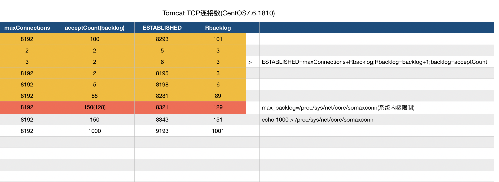

# netcrazy
springboot的网络性能压榨

## 最大TCP ESTABLISHED连接数
CentOS Linux release 7.6.1810 (Core)
Linux version 3.10.0-957.21.3.e17.x86_64



结论：

​	accpetCount对应是socket listen函数的backlog参数，可以通过ss命令查看，如下其中的Send-Q的值为backlog。tcp维护着两个队列，分别为未完成连接队列（状态为SYN_RECV）和已完成连接队列（状态为ESTABLISHED）。已完成队列是完成三次握手等待服务端accpet，backlog可以控制已完成队列的大小，不同系统的backlog参数实现会有差异，根据上面的测试数据可以得出CentOS Linux release 7.6.1810 (Core)完成队列的实际大小等于backlog+1。同时backlog受/proc/sys/net/core/somaxconn内核参数限制（默认128），可以修改somaxconn以增大backlog，也就是tomcat的accpetCount参数。

```
ss -antl |awk 'NR==1 ||$4~/8080/'
State      Recv-Q Send-Q Local Address:Port               Peer Address:Port              
LISTEN     0      2         [::]:8080                  [::]:*
```


